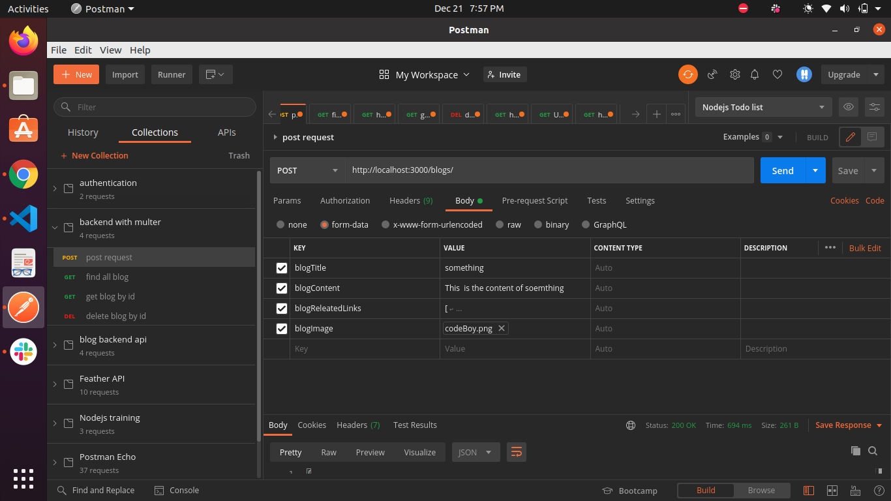

# Blog backend

This is Nodejs-express project. Which is implemented to learn the fundamentals of express with multer module.
In this project we make the server using express and having api to send the req.
We also implemented the the crud operation using mongodb atlas

### LIST Of API

- /blogs - sned get req to get all the task
- /blogs - sned post req to create the task
- /blogs:id - send get req to fetch blogs with respective id
- /blogs:id - send delete req to delete blogs'k with respective id

#### example to send create req body in json:

`Key:value`

```json
{
  "blogTitle": "sleep",
  "blogContent":"This  is the content of soemthing",
  "blogReleatedLinks":"[
  {
    "linkId": "ayc2t33kiuhhbmy",
    "title": "java the hero"
  }
]"
"blogImage":"avatar.png"
}
```

### send the postman request in following manner

<p align="center">
  </img>
</p>

## folder structure

```sh
.
├── app.js
├── blogImages
│   └── images
├── config.env
├── controller
│   └── blogController.js
├── helpers
│   └── deleteImage.js
├── middleware
│   ├── blogMiddleware.js
│   └── multerMiddleware.js
├── models
│   ├── blogSchema.js
│   ├── mongoConnection.js
│   └── mongoCrud.js
├── package.json
├── README.md
└── routers
    └── blogRouter.js
```

## Installation

Install the dependencies and start the server.

### prerequisite

1. vscode editor
2. node js installed
3. npm installed

### steps

1. > clone this project
2. > go into to the the project folder
3. > open the terminal

4. > open vscode using following command

```sh
$ code .
```

5. > Install the dependencies

```sh
$ npm install

```

6. > run the project

```sh
$ npm run start
```

#### Configure config.env parametre

> PORT = <3000>

config the PORT number

> DATABASE= mongoDb

database you want to use config that database

> MONGO_URL=<LINK-OF-ATLAS-COLLECTIONS>

Use the atlas mongo connect link here

> IMAGE_SIZE=1024 _ 1024 _ 5
> config the image-size paramter
